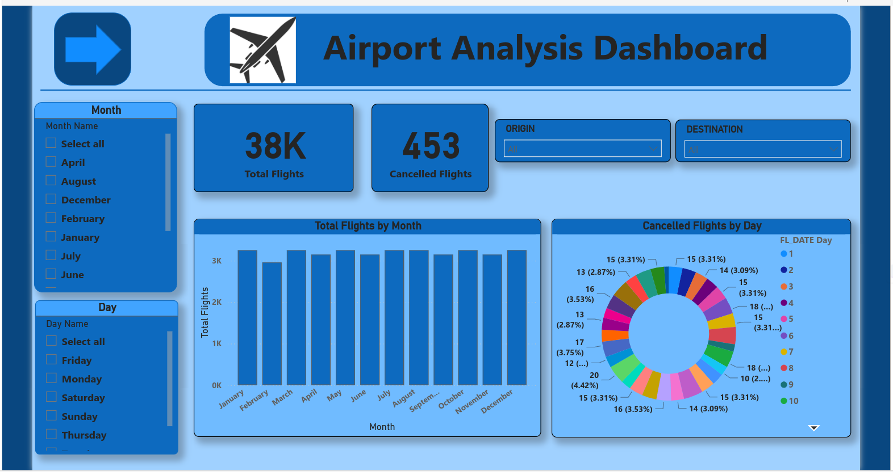
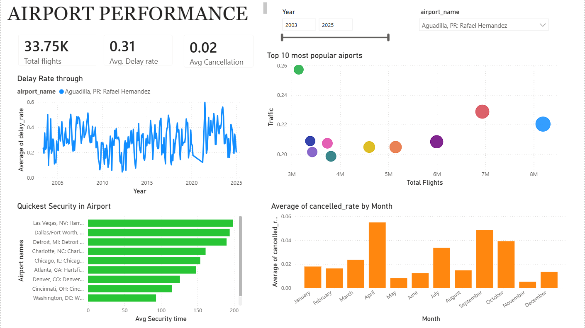

# Airport Analysis Dashboard - README

## Overview

Welcome to the Airport Analysis Dashboard! This Power BI dashboard is designed to provide a comprehensive analysis of airport operations, focusing on flight delays, time analysis, and detailed flight information. It aims to assist airport management, airline operators, and other stakeholders in making informed decisions to improve efficiency and passenger satisfaction.

## Overview

- **Delay Trends**: Visualizations showing the trend of delays over time (daily, weekly, monthly).
- **Delay Causes**: Analysis of the primary causes of delays (e.g., weather, technical issues, air traffic control).
- **Peak Delay Times**: Identification of times of day and days of the week with the highest delays.
- **Delay Distribution**: Distribution of delays by duration (e.g., 0-15 minutes, 16-30 minutes, etc.).

This analysis helps identify patterns and potential areas for operational improvements.

## Data Sources

The dashboard utilizes the following data sources:

- **Flight Data**: Information on flight schedules, departure and arrival times, delays, and cancellations.
- **Weather Data**: Historical weather data affecting flight operations.
- **Passenger Feedback**: Data from passenger surveys and feedback forms.
- **Airport Operations Data**: Data on ground operations, including baggage handling, boarding processes, and security checks.

Ensure these data sources are updated regularly to maintain the accuracy and relevance of the dashboard.

## Usage

- **Filtering and Slicing**: Use the built-in filters and slicers to focus on specific time periods, airlines, routes, or other dimensions.
- **Interactivity**: Click on different visual elements to drill down into more detailed data and uncover deeper insights.
- **Exporting Data**: Export specific data views or visualizations as needed for reporting or presentations.

### Photos

#### Overview Page

Thank you for using the Airport Analysis Dashboard. We hope this tool helps you enhance airport operations and improve the overall passenger experience.
